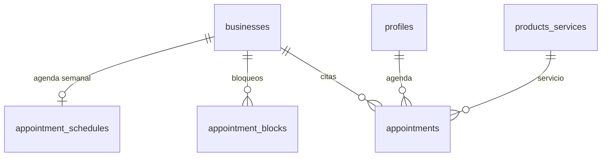

# Sistema de Citas — Plan de Implementacion

Feature opt-in para negocios de servicios (barberias, medicos, salones, etc.) que permite gestionar citas con horarios especificos y disponibilidad en tiempo real.

---

## Diferencia con el sistema actual de reservas

| | Reservas (actual) | Citas (nuevo) |
|--|-------------------|---------------|
| **Uso** | Apartar productos o pedir servicios en una fecha | Agendar un horario especifico y exclusivo |
| **Slots** | Fecha + hora libre (sin bloqueo) | Slots generados desde disponibilidad, se bloquean al reservar |
| **Aprobacion** | Negocio confirma manualmente | Negocio aprueba/rechaza con vista de calendario |
| **Visibilidad** | No se ve disponibilidad real | El cliente ve slots libres vs ocupados |
| **Negocios** | Todos | Solo los que activan `appointments_enabled` |

---

## 1. Modelo de Datos

### Modificar tabla existente

```sql
-- Agregar flag a businesses
ALTER TABLE businesses
  ADD COLUMN appointments_enabled boolean DEFAULT false;
```

### Nuevas tablas

```sql
-- Slots de disponibilidad recurrente (la agenda semanal del negocio)
CREATE TABLE appointment_schedules (
  id uuid PRIMARY KEY DEFAULT gen_random_uuid(),
  business_id uuid NOT NULL REFERENCES businesses(id) ON DELETE CASCADE,
  day_of_week int NOT NULL CHECK (day_of_week BETWEEN 0 AND 6),
  start_time time NOT NULL,
  end_time time NOT NULL,
  slot_duration int NOT NULL DEFAULT 30, -- minutos por cita
  max_concurrent int DEFAULT 1,          -- citas simultaneas (1 = una a la vez)
  is_active boolean DEFAULT true,
  UNIQUE(business_id, day_of_week)
);

-- Bloqueos puntuales (vacaciones, dias especiales)
CREATE TABLE appointment_blocks (
  id uuid PRIMARY KEY DEFAULT gen_random_uuid(),
  business_id uuid NOT NULL REFERENCES businesses(id) ON DELETE CASCADE,
  block_date date NOT NULL,
  start_time time,           -- NULL = todo el dia bloqueado
  end_time time,
  reason text,
  created_at timestamptz DEFAULT now()
);

-- Citas agendadas
CREATE TABLE appointments (
  id uuid PRIMARY KEY DEFAULT gen_random_uuid(),
  business_id uuid NOT NULL REFERENCES businesses(id) ON DELETE CASCADE,
  user_id uuid NOT NULL REFERENCES profiles(id) ON DELETE CASCADE,
  service_id uuid REFERENCES products_services(id) ON DELETE SET NULL,
  appointment_date date NOT NULL,
  start_time time NOT NULL,
  end_time time NOT NULL,
  status text DEFAULT 'pending'
    CHECK (status IN ('pending', 'confirmed', 'completed', 'cancelled', 'no_show')),
  notes text,
  cancellation_reason text,
  confirmed_at timestamptz,
  completed_at timestamptz,
  cancelled_at timestamptz,
  created_at timestamptz DEFAULT now()
);

CREATE INDEX idx_appointments_business_date ON appointments(business_id, appointment_date);
CREATE INDEX idx_appointments_user ON appointments(user_id, status);
```

### Relacion entre tablas



---

## 2. Archivos a Crear

### Backend

```
supabase/migrations/
└── 004_appointments.sql                # Tablas + RLS

lib/queries/
└── appointments.ts                     # Queries: getSchedule, getAppointments, getAvailableSlots

lib/validations/
└── appointment.ts                      # Zod schemas
```

### Dashboard del negocio

```
app/dashboard/appointments/
├── page.tsx                            # Vista calendario con citas del dia/semana
├── actions.ts                          # confirm, complete, cancel, block
├── loading.tsx                         # Skeleton
└── schedule/
    ├── page.tsx                        # Configurar agenda semanal
    └── actions.ts                      # CRUD schedule

components/dashboard/
├── AppointmentCalendar.tsx             # Vista semanal/diaria con slots
├── AppointmentCard.tsx                 # Card de cita individual
├── AppointmentScheduleForm.tsx         # Configurar horarios por dia
└── AppointmentBlockForm.tsx            # Bloquear fecha/horario
```

### Pagina publica del negocio

```
components/businesses/
├── BookAppointmentModal.tsx            # Modal con selector de fecha → slots disponibles
└── AvailabilityPreview.tsx             # Mini-vista de disponibilidad en perfil

components/account/
└── AppointmentCard.tsx                 # Card de cita en /account/bookings
```

---

## 3. Flujos Principales

### Flujo 1: Negocio configura su agenda

1. Dueño activa "Gestion de citas" en settings del dashboard
2. Va a `/dashboard/appointments/schedule`
3. Configura por dia: horario de inicio, fin, duracion de slot
4. Ejemplo: **Lunes** 9:00-18:00, slots de 30min = 18 slots
5. Puede bloquear fechas especificas (vacaciones, puentes)

### Flujo 2: Cliente agenda una cita

1. Ve perfil del negocio → boton "Agendar cita"
2. Selecciona **servicio** (ej: "Corte de cabello", 30min, $150)
3. Selecciona **fecha** (solo dias con agenda activa)
4. Ve **slots disponibles** (los ya ocupados estan grises/deshabilitados)
5. Selecciona slot → confirma → cita creada con status `pending`

### Flujo 3: Negocio gestiona citas

1. Ve su calendario en `/dashboard/appointments`
2. Vista por dia o semana con slots y citas
3. Puede: **Confirmar** → **Completar** o **Cancelar** con razon
4. Indicadores visuales: pendiente (amarillo), confirmada (azul), completada (verde)

### Flujo 4: Calculo de slots disponibles

```
Inputs:
  - appointment_schedules (agenda semanal)
  - appointment_blocks (bloqueos puntuales)
  - appointments existentes (status != cancelled)
  - Duracion del servicio seleccionado

Algoritmo:
  1. Obtener schedule del dia seleccionado
  2. Generar todos los slots posibles (start_time → end_time, step = slot_duration)
  3. Filtrar: remover slots que caen dentro de un block
  4. Filtrar: remover slots que ya tienen max_concurrent citas confirmadas/pendientes
  5. Filtrar: remover slots cuyo horario + duracion_servicio excede end_time
  6. Retornar slots disponibles
```

---

## 4. UI del Calendario (Dashboard)

```
┌─────────────────────────────────────────────────┐
│  ← Febrero 2026 →        [Dia] [Semana]  [+Block]│
├─────────────────────────────────────────────────┤
│  Lunes 24                                        │
│  ┌──────────────────────────────────────────┐   │
│  │ 09:00  ▓ Juan P. - Corte  (Confirmada)   │   │
│  │ 09:30  ░ Disponible                       │   │
│  │ 10:00  ▓ Maria L. - Tinte (Pendiente)    │   │
│  │ 10:30  ░ Disponible                       │   │
│  │ 11:00  ░ Disponible                       │   │
│  │ ...                                       │   │
│  └──────────────────────────────────────────┘   │
└─────────────────────────────────────────────────┘
```

---

## 5. Integracion con Features Existentes

| Feature existente | Como se integra |
|-------------------|----------------|
| **Perfil publico** | Si `appointments_enabled`, mostrar boton "Agendar cita" junto a "Enviar mensaje" |
| **Dashboard sidebar** | Nuevo link "Citas" (solo si `appointments_enabled`) |
| **Account bookings** | Las citas del usuario aparecen en `/account/bookings` junto a las reservas |
| **Servicios** | Los servicios con `is_bookable` del negocio son los que se pueden agendar |
| **business_hours** | Se usa como referencia base; `appointment_schedules` lo complementa con granularidad |

---

## 6. RLS Policies

```sql
-- Schedules: publico read, owner write
CREATE POLICY "schedules_read" ON appointment_schedules FOR SELECT USING (true);
CREATE POLICY "schedules_write" ON appointment_schedules FOR ALL
  USING (business_id IN (SELECT id FROM businesses WHERE owner_id = auth.uid()));

-- Blocks: publico read (para calcular disponibilidad), owner write
CREATE POLICY "blocks_read" ON appointment_blocks FOR SELECT USING (true);
CREATE POLICY "blocks_write" ON appointment_blocks FOR ALL
  USING (business_id IN (SELECT id FROM businesses WHERE owner_id = auth.uid()));

-- Appointments: user ve las suyas, owner ve las de su negocio
CREATE POLICY "appointments_read" ON appointments FOR SELECT
  USING (auth.uid() = user_id
    OR business_id IN (SELECT id FROM businesses WHERE owner_id = auth.uid()));
CREATE POLICY "appointments_insert" ON appointments FOR INSERT
  WITH CHECK (auth.uid() = user_id);
CREATE POLICY "appointments_update" ON appointments FOR UPDATE
  USING (auth.uid() = user_id
    OR business_id IN (SELECT id FROM businesses WHERE owner_id = auth.uid()));
```

---

## 7. Orden de Implementacion

```
Semana 1: Fundamentos
├── Migration SQL (tablas + RLS)
├── Flag appointments_enabled en businesses
├── appointment_schedules CRUD (dashboard)
├── appointment_blocks CRUD (dashboard)
└── Funcion getAvailableSlots

Semana 2: Flujo del cliente
├── BookAppointmentModal (selector fecha → slots → confirmar)
├── Integracion en perfil publico del negocio
├── Vista de citas en /account/bookings
└── Server actions: createAppointment

Semana 3: Dashboard del negocio
├── Vista calendario (dia/semana)
├── Gestion de citas (confirmar, completar, cancelar)
├── Indicadores visuales y estados
└── Pulido y testing
```

---

## 8. Dependencias Nuevas

```bash
# Ninguna obligatoria — se puede hacer con los componentes existentes:
# - Calendar de shadcn/ui (ya instalado)
# - date-fns (ya instalado)
# - Tabs/Badge/Dialog (ya instalados)
```
